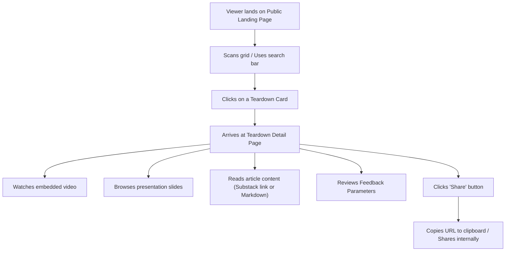
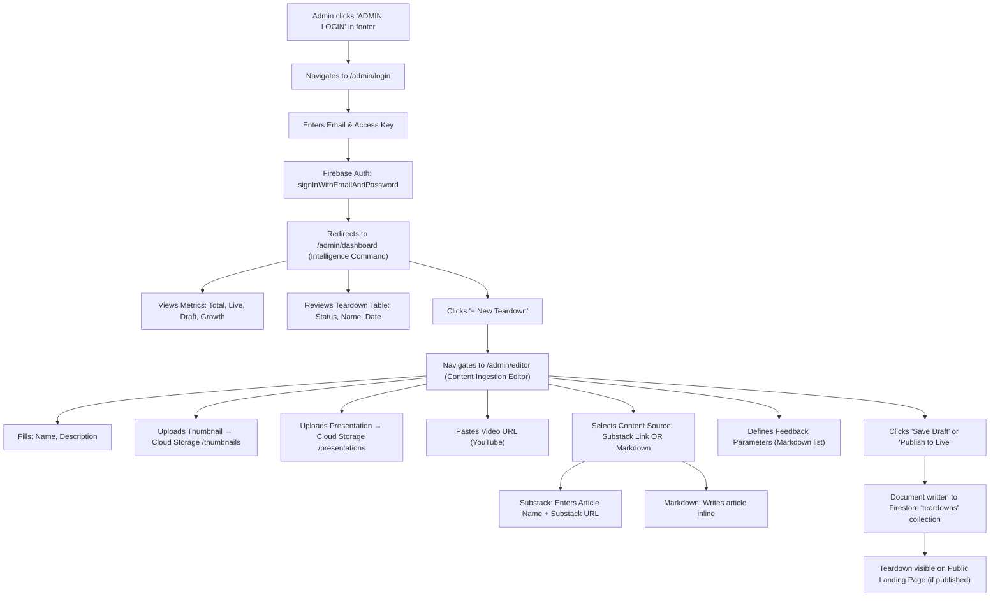

# AI Teardowns — Product Overview (PRD)

> **Version:** 1.2  
> **Classification:** Internal — Architecture Document  
> **Last Updated:** 2026-03-07

---

## 1. Executive Summary

**AI Teardowns** is a boutique **Technical & UX Due Diligence as a Service** platform that delivers structured, deep-dive analyses of AI-native products, architectures, and interface patterns. The platform targets an elite audience of VCs, PEs, founders, and senior operators who require an institutional-grade research feed to inform investment theses, competitive strategy, and product development.

The product operates on a **Creator → Consumer** content pipeline:

1.  A single authenticated **Admin/Creator** authors, uploads, and publishes teardown intelligence reports.
2.  Reports surface on an unauthenticated **Public Discovery Interface** where viewers consume multi-modal content (video, presentation slides, written analysis) and evaluate quality via embedded feedback parameters.

The value proposition is precision: each teardown is a curated, multi-format intelligence artifact — not a blog post. The platform differentiates through a brutalist, data-centric design language that signals exclusivity and technical rigor.

---

## 2. Target Personas

### 2.1 Viewer (Public Consumer)

| Attribute         | Detail                                                                                                    |
| :---------------- | :-------------------------------------------------------------------------------------------------------- |
| **Title**         | VC Partner, PE Associate, CTO, VP of Product, Founder                                                     |
| **Goal**          | Consume structured technical intelligence on AI products to inform investment, build, or buy decisions.    |
| **Pain Point**    | Generic tech blogs lack depth; internal diligence is slow and expensive.                                  |
| **Key Behavior**  | Arrives via direct link or search; scans the grid; drills into a teardown; watches the video; reviews the presentation; shares the report internally. |
| **Success Metric**| Finds a relevant teardown in < 30 seconds. Consumes all media formats. Shares to a colleague via URL.      |

### 2.2 Creator / Admin (System Owner)

| Attribute         | Detail                                                                                                    |
| :---------------- | :-------------------------------------------------------------------------------------------------------- |
| **Title**         | Platform Owner / Sole Content Author                                                                      |
| **Goal**          | Efficiently draft, enrich, and publish multi-format teardown reports.                                     |
| **Pain Point**    | Juggling video hosts, slide decks, thumbnails, and article text across multiple tools.                    |
| **Key Behavior**  | Logs in via Firebase Auth; accesses the Intelligence Command dashboard; creates a new teardown via the Content Ingestion Editor; uploads a thumbnail and presentation to Cloud Storage; embeds a YouTube video URL; toggles between a Substack link or inline Markdown for the written analysis; publishes. |
| **Success Metric**| End-to-end teardown creation in < 15 minutes. Zero-downtime publishing.                                   |

---

## 3. Feature Breakdown (Mapped to Screens)

### 3.1 Public Landing & Discovery Page (Screen 1)

| Feature                       | Detail                                                                                           |
| :---------------------------- | :----------------------------------------------------------------------------------------------- |
| **Centered Brand Header**     | Logo icon (`deployed_code`) + `AI TEARDOWNS` wordmark. Centered navigation.                      |
| **Hero Section**              | Large headline "AI Teardowns" with tagline for VCs, PEs, elite operators, founders.               |
| **Dynamic Search Bar**        | Full-width input with search icon. Placeholder: *"Search teardowns, architectures, or startups..."* |
| **Teardown Card Grid**        | 3-column responsive grid (`md:grid-cols-3`). Each card contains: a 16:9 aspect-ratio thumbnail (loaded from Cloud Storage URL), a monospace title (e.g., `Sora_v1_Architecture`), a description clamped to 3 lines, and a date stamp in `MM.DD.YYYY` format. |
| **Load More Pagination**      | "Load More Teardowns" button for progressive loading.                                             |
| **Footer**                    | Copyright, Privacy/Terms/Contact links (routed pages), and a discreet `ADMIN LOGIN` link for the creator.        |

### 3.2 Public Teardown Detail Page (Screen 2)

| Feature                       | Detail                                                                                           |
| :---------------------------- | :----------------------------------------------------------------------------------------------- |
| **Sticky Header**             | "Back to Archive" CTA, `AI Teardowns` logo, and a **Share** button.                              |
| **Hero Title**                | Full teardown name (e.g., "NeuralArchitect Pro") in bold 5xl–7xl type with a descriptive subtitle. |
| **Video Player**              | Full-width, 16:9 aspect-ratio container. Displays a play button overlay, a progress bar with timestamp markers (`04:12 / 12:45`), and a background poster image. Supports YouTube or embedded video via URL. |
| **Presentation Viewer**       | Embedded presentation slide image under a "Detailed Teardown" heading. Content displayed as an `` within a styled container. Sourced from Cloud Storage. |
| **Content / Article Section** | Prose-styled HTML container for the written analysis. Supports either a link to a Substack article or inline rendered Markdown. |
| **Feedback Module**           | *(Derived from Editor Screen 5)* Displays the markdown-defined feedback parameters (e.g., Architecture Clarity, Technical Depth, Implementation Feasibility) for viewer evaluation. |
| **Share CTA**                 | Header button to copy the teardown URL for distribution.                                          |

### 3.3 Admin Login (Screen 3)

| Feature                       | Detail                                                                                           |
| :---------------------------- | :----------------------------------------------------------------------------------------------- |
| **Professional UI**           | Minimal, dark background (`#101622`), rounded containers, professional sans-serif typography (Inter).               |
| **Email Field**               | Input with `alternate_email` icon. Placeholder: `admin@aiteardowns.ai`.                          |
| **Password (Access Key)**     | Masked input with `lock` icon.                                                                   |
| **Authenticate Button**       | Full-width primary-colour button. Triggers Firebase `signInWithEmailAndPassword`.                 |
| **Forgot Credentials**        | Minor link for password recovery (Firebase `sendPasswordResetEmail`).                             |
| **System Status Footer**      | Decorative status line: `System Status: Online | Node: 0x1A4F`.                                  |

### 3.4 Admin Dashboard — Intelligence Command (Screen 4)

| Feature                       | Detail                                                                                           |
| :---------------------------- | :----------------------------------------------------------------------------------------------- |
| **Sidebar Navigation**        | Fixed 256px sidebar with links: **Dashboard** (active), **Teardowns**, **Analytics**, **Settings**. User avatar and version number at the bottom. |
| **Header Bar**                | Title "Intelligence Command" + primary **"+ New Teardown"** button (routes to the Content Editor). |
| **Metrics Summary (4-card)**  | `Total Teardowns` (e.g., 128), `Live Status` (e.g., 94, emerald), `Draft Items` (e.g., 34, amber), `Monthly Growth` (e.g., +12.4%). Computed from Firestore aggregation. |
| **Teardown Data Table**       | Columns: **Status** (Live badge / Draft badge), **Name** (title + subtitle), **Date Uploaded** (mono date), **Action** (Edit link, Delete button with confirmation prompt). |
| **Pagination**                | "Showing 1 to 6 of 128 teardowns" with page number buttons.                                      |

### 3.5 Content Ingestion Editor — Drafting New Teardown (Screen 5)

| Feature                       | Detail                                                                                           |
| :---------------------------- | :----------------------------------------------------------------------------------------------- |
| **Header Actions**            | **Save Draft** (secondary) and **Publish to Live** (primary) buttons.                            |
| **Required Fields Section**   |                                                                                                  |
| → Teardown Name               | Text input for the report title.                                                                 |
| → Description                 | Textarea for a brief summary.                                                                    |
| → Thumbnail *                 | Drag-and-drop upload zone. Accepted: PNG/JPG, 16:9 recommended, max 5MB. **Uploads to Firebase Cloud Storage `/thumbnails`**. |
| → Presentation Assets         | Drag-and-drop upload zone. Accepted: PDF/PPTX/Keynote, max 50MB. **Uploads to Firebase Cloud Storage `/presentations`**. |
| **Optional Components Section** (`settings_suggest`) |                                                                         |
| → Video URL                   | Text input with link icon. Accepts a YouTube URL string (not a file upload).                     |
| → Content Links               | Dynamic list of content name+URL pairs. Users can add, edit, or remove multiple content links.                     |
| → Feedback Parameters         | Textarea with Markdown support. Placeholder: `- Architecture Clarity / - Technical Depth / - Implementation Feasibility`. |
| **Footer**                    | Autosave indicator, Preview Mode link, Editor Guide link, Asset Requirements link.               |

---

## 4. User Flows

### 4.1 Viewer Flow

**Step-by-step:**

1.  **Arrival**: Viewer loads the public landing page (`/`). The page renders a hero headline, a full-width search bar, and a paginated 3-column grid of teardown cards fetched from Firestore (`status == 'published'`).
2.  **Discovery**: Viewer optionally types into the search bar to filter teardowns by name, description, or technology keywords. Results update dynamically.
3.  **Selection**: Viewer clicks a card, navigating to the Teardown Detail page (`/teardowns?id=[slug]`).
4.  **Consumption**:
    *   **Video**: Viewer clicks the play button on the embedded video player. The video loads from the stored `video_url` (e.g., YouTube embed).
    *   **Presentation**: Viewer scrolls to the embedded presentation asset, rendered as a viewable slide.
    *   **Article**: Viewer reads the long-form analysis, sourced either from an embedded Substack link or rendered Markdown.
    *   **Feedback**: Viewer reviews the feedback parameters listed for the teardown.
5.  **Sharing**: Viewer clicks the **Share** button in the header. The canonical URL is copied. Viewer sends the URL to colleagues.

### 4.2 Creator / Admin Flow

**Step-by-step:**

1.  **Authentication**: Admin clicks the `ADMIN LOGIN` link in the public footer, navigating to `/admin/login`. They enter their email and access key. Firebase `signInWithEmailAndPassword` authenticates the session.
2.  **Dashboard Review**: On successful login, the admin is redirected to `/admin/dashboard`. The Intelligence Command view displays:
    *   **Metrics cards** (Total Teardowns, Live, Draft, Monthly Growth) — computed from Firestore document counts.
    *   **Data table** listing all teardowns with Status, Name, Date, and an Edit action.
3.  **Initiate New Report**: Admin clicks the **"+ New Teardown"** button, navigating to `/admin/editor`.
4.  **Content Authoring**:
    *   Fills in the **Teardown Name** and **Description** (required text fields).
    *   **Thumbnail Upload**: Drags/drops an image (PNG/JPG, 16:9, max 5MB). File uploads to Firebase Cloud Storage under `/thumbnails/{filename}`. The returned `downloadURL` is stored in the Firestore document as `thumbnail_url`.
    *   **Presentation Upload**: Drags/drops a deck (PDF/PPTX/Keynote, max 50MB). File uploads to Cloud Storage under `/presentations/{filename}`. The returned `downloadURL` is stored as `presentation_url`.
    *   **Video URL**: Pastes a YouTube link into the text input. Stored as a string field `video_url`.
    *   **Content Source**: Toggles between:
        *   **Substack Link**: Enters the *Article Name* (`article_name`) and *Substack URL* (`substack_url`). `content_source_type` is set to `substack`.
        *   **Markdown Editor**: Writes the full article body in the textarea. Content stored as `article_markdown`. `content_source_type` is set to `markdown`.
    *   **Feedback Parameters**: Defines evaluation metrics as a Markdown list (e.g., `- Architecture Clarity`). Stored as `feedback_parameters` (string).
5.  **Publishing**: Admin clicks **"Save Draft"** (sets `status: 'draft'`) or **"Publish to Live"** (sets `status: 'published'`). The complete document is written to the Firestore `teardowns` collection.
6.  **Verification**: The published teardown immediately appears on the public landing page grid for viewer consumption.

---

## 5. Content Model Summary

| Field                   | Type     | Required | Source (from Screen 5)                        |
| :---------------------- | :------- | :------- | :-------------------------------------------- |
| `name`                  | `string` | ✅        | Teardown Name input                           |
| `description`           | `string` | ✅        | Description textarea                          |
| `thumbnail_url`         | `string` | ✅        | Resolved after Cloud Storage upload           |
| `presentation_url`      | `string` | ✅        | Resolved after Cloud Storage upload           |
| `status`                | `string` | ✅        | `'draft'` or `'published'` via button action  |
| `createdAt`             | `timestamp` | ✅     | Auto-generated server timestamp               |
| `video_url`             | `string` | ❌        | Video URL input (Optional Components)         |
| `content_links`         | `array`  | ❌        | Array of `{name, url}` pairs for article/reference links |
| `feedback_parameters`   | `string` | ❌        | Feedback Parameters textarea (Markdown list)  |
| `slug`                  | `string` | ❌        | URL-safe identifier (auto-generated from name) |

---

*This document serves as the canonical Product Requirements Document for the AI Teardowns platform. All system design, implementation, and testing decisions must align with the features, flows, and content model defined herein.*
